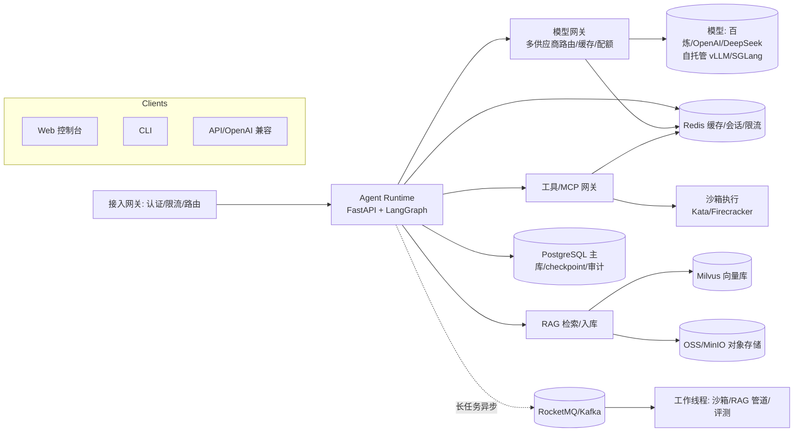

# Flare Agent · 企业级 AI Agent 平台

> **Enterprise-grade AI Agent platform** — 对标 OpenAI Codex / Claude Code / DeepSeek Harness。
> 可上线 · 高可用 · 可扩展 · 可运维 · 可审计，面向百万级并发设计。

[](https://github.com/Syotick/flare-agent/actions/workflows/ci.yml)
[](LICENSE)


---

## 特性

- **Agent 编排（LangGraph）**：图式状态机、长任务 checkpoint 断点续跑、human-in-the-loop 审批、多 Agent/Subagent、预算熔断
- **工具系统 + MCP**：统一 ToolRegistry、MCP 网关（鉴权/限流/审计/白名单）、工具权限分级
- **Skills**：声明式技能包、可安装/版本化、技能市场
- **RAG 全栈**：多路召回 / 混合检索（向量 + BM25 + RRF）/ Rerank 重排 / 查询改写 / GraphRAG / RAGAS 评测，带溯源引用
- **分层记忆**：会话短期（Redis）+ 项目长期（PG）+ 向量记忆，上下文工程（截断/摘要/抽取）
- **多模型路由**：OpenAI 兼容网关，多供应商、灰度降级、语义缓存、租户配额与成本治理
- **强隔离沙箱**：Kata Containers / Firecracker 微虚拟化（本地 Docker 降级），网络出口白名单、资源限额
- **可观测（LLMOps）**：OpenTelemetry + GenAI 语义约定，一条任务一条 trace，成本/命中/评测全可看
- **多租户与安全**：租户强隔离、RBAC、Prompt 注入防护、审计日志、密钥 KMS 托管
- **云原生**：部署阿里云 ACK + OSS（对象底座），弹性扩展到百万级并发

## 架构总览



## 技术栈

| 层 | 选型 |
| --- | --- |
| 编排 | LangGraph (Python) |
| API | FastAPI / SSE / WebSocket |
| 前端 | Vite + React（本地 Web 优先） |
| 数据库 | PostgreSQL（含 pgvector 兜底） |
| 缓存/会话 | Redis |
| 向量库 | Milvus（Qdrant/pgvector 兜底） |
| 消息 | RocketMQ / Kafka（本地 Redis Streams 降级） |
| 对象存储 | 阿里云 OSS（本地 MinIO 模拟） |
| 沙箱 | Kata/Firecracker 微虚拟化（本地 Docker） |
| 推理 | vLLM / SGLang（自托管，可选） |
| 可观测 | OpenTelemetry + Prometheus/Grafana + Loki |
| 部署 | 阿里云 ACK (K8s) + GitHub Actions |

> 每项选型均有 ADR 决策记录（docs/adr/），可追溯为什么这么做。

## 快速开始（本地开发）

> 前置：Docker、Python 3.12、Node 20+

```bash
# 1. 克隆
git clone https://github.com/Syotick/flare-agent.git && cd flare-agent
# 2. 起本地依赖（PG/Redis/Milvus/MinIO 等）
docker compose -f infra/docker-compose.yml up -d
# 3. 配置环境
cp .env.example .env   # 填入模型 API Key（默认支持 DeepSeek/通义兼容接口）
# 4. 启动服务（模块化单体）
make dev
# 或分别启动：uvicorn services.agent_runtime.main:app ...
# Web 控制台：http://localhost:5173
```

> 详细操作见 docs/guides/README.md（建设中）。

## 路线图

| 里程碑 | 内容 | 状态 |
| --- | --- | --- |
| M0 | 项目准备：Git/仓库/文档/工程化配置 | ✅ |
| M1 | 需求与架构评审：技术选型定稿（ADR ×15）、模块设计、压测方案 | ✅ |
| M2 | 核心 Agent 引擎：编排运行时 + 工具系统 + 会话 + Web | 🔨 开发中 |
| M3 | RAG + 记忆：入库管线 + 混合检索 + 重排 + 分层记忆 + 评测 | ⏳ |
| M4 | 模型网关 + 沙箱：多模型路由/配额 + Kata 沙箱 | ⏳ |
| M5 | 云原生上线：ACK + OSS + 可观测 + 多租户 + 压测 | ⏳ |
| M6 | 生产运营：灰度、容量、成本、SLO 运营 | ⏳ |

## 文档

- [文档中心](docs/README.md) — 总索引 + 文档管理规范（唯一入口）
- [项目记忆](CLAUDE.md) — 方向/约束/决策/进度
- [开发流程与工程规范](docs/engineering/01-development-standards.md) — CI/CD/测试/评审/发布/SRE
- [高级 Agent 工程师面试题库（实践 + 真理）](docs/learning/01-agent-interview-questions.md)

## 参与贡献

欢迎贡献！请先阅读 [CONTRIBUTING.md](CONTRIBUTING.md) 与 [Code of Conduct](CODE_OF_CONDUCT.md)：

- 分支命名 feat/<module>-<desc>，提交遵循 Conventional Commits
- PR 需过 CI（lint/测试/扫描）与 Eval（AI 相关改动）
- 安全漏洞请走 [SECURITY.md](SECURITY.md) 私有通道

## License

[MIT](LICENSE) © 2026 Syotick

---

> ⚠️ 项目开发中（pre-1.0），接口与架构可能变更，请关注 Release 说明。