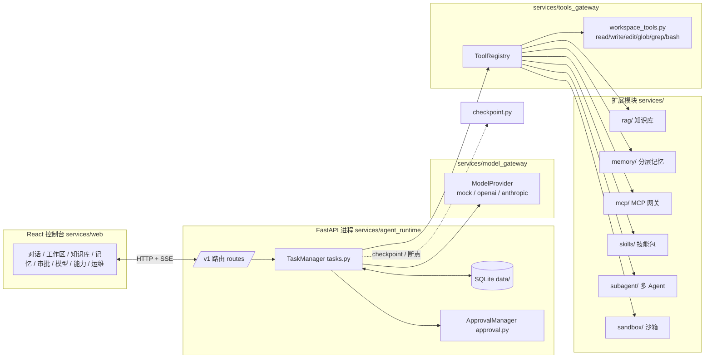
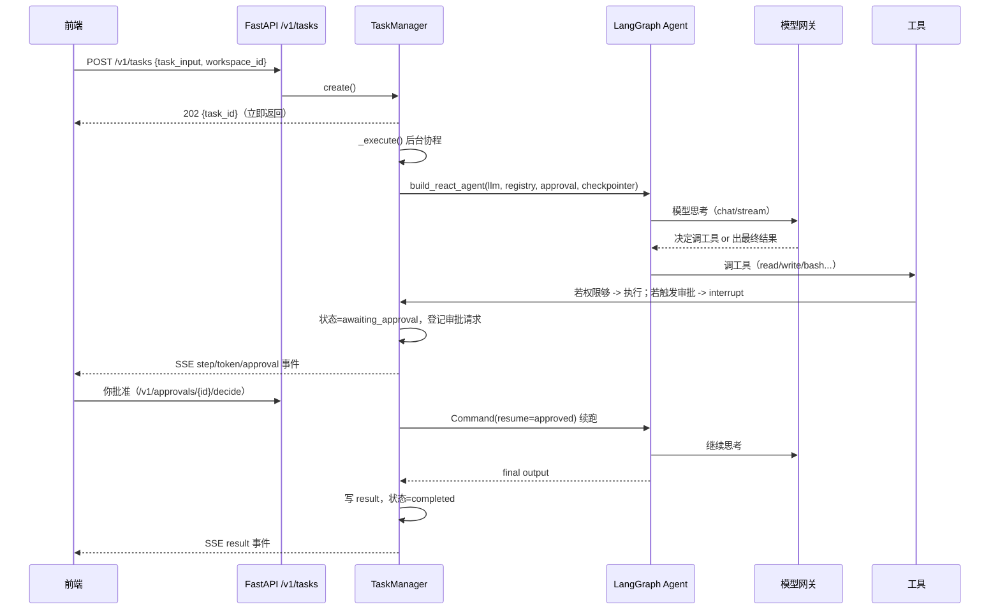

# 03 · 架构详解

> 目标读者：想读懂代码结构、知道"一次任务在系统里怎么走"的人。
> 读完本篇你会：**看懂模块依赖、知道关键文件在哪、能跟着一次任务走完整条链路**。

---

## 1. 总体架构



## 2. 模块职责 + 代码地图

| 模块 | 关键文件 | 职责 |
| --- | --- | --- |
| `agent_runtime` | `app.py`（应用工厂）、`main.py`（入口，挂前端 dist）、`tasks.py`（TaskManager：创建/执行/SSE）、`graph.py`（LangGraph 图构建）、`approval.py`（审批门+TOFU）、`workspace_fs.py`（目录浏览）、`model_config.py`（模型配置/供应商 profile）、`task_store.py`（memory/sqlite/redis） | FastAPI 主应用 + 任务编排 |
| `model_gateway` | `gateway.py`（build_provider + 重试）、`openai_compat.py`、`anthropic_compat.py`、`mock.py`、`providers.py`（LLMResponse 抽象） | 统一模型入口 |
| `tools_gateway` | `registry.py`（Tool/ToolRegistry/权限分级）、`workspace_tools.py`（六工具）、`builtin.py`（echo/sandbox_run 等） | 工具注册与执行 |
| `rag` | `pipeline.py`（KnowledgeBase）、`store.py`（SqliteVectorStore） | 知识库入库/检索/评测 |
| `memory` | `memory.py`（MemoryManager）、`mem_tools.py` | 长期事实 + 向量记忆 + 上下文块 |
| `sandbox` | `sandbox.py`（build_sandbox） | 本地子进程执行（未来容器） |
| `mcp` | `gateway.py`（McpGateway）、`mcp_tools.py` | MCP 服务器管理 + 工具桥接 |
| `skills` | `registry.py`（SkillRegistry）、`skill_tools.py` | 技能包加载与调用 |
| `subagent` | `runtime.py`（SubagentRuntime）、`sub_tools.py` | 任务内派生子任务 |
| `flare_common` | `config.py`（Settings）、`errors.py`（错误契约）、`metrics.py`、`tenant.py` | 横切能力 |
| `flare_cli` | `main.py` | 命令行入口（`flare`） |

## 3. 一次任务的完整数据流



## 4. 关键设计决策（为什么这样写）

| 决策 | 原因 |
| --- | --- |
| 任务先返回、后台执行（202 + SSE） | 长任务不阻塞请求，前端实时看过程 |
| 工具 = 注册表 + 每任务视图 | 工作区工具闭包绑定 cwd、observed 状态随任务隔离 |
| read 前置 + edit 版本 CAS | 对标 DSH fs-observation-policy：防 AI 盲目覆盖 |
| 审批用 LangGraph interrupt | human-in-the-loop 是 LangGraph 一等公民，中断/恢复由框架托管 |
| 模块化单体（services/ 平铺包） | 单进程可跑全量，未来按需拆服务（ADR-0015） |
| 全部可配置（FLARE_ 前缀） | 12-factor：同一份代码从 mock 到生产只改环境变量 |

## 5. 启动路径

```
python -m uvicorn agent_runtime.main:app
  └─ main.py 调 create_app(...)，并挂载 services/web/dist 到 /
     └─ app.py：组装 approval / model_store / registry / kb / memory / task_manager
        └─ 注册所有 router：tasks / workspaces / kb / memory / model / approval / capabilities / ops / openai_compat
```

## 下一步

→ [04 · 二次开发](04-developer-guide.md)：加一个工具、加一个 API、跑测试、用 CLI。
